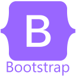
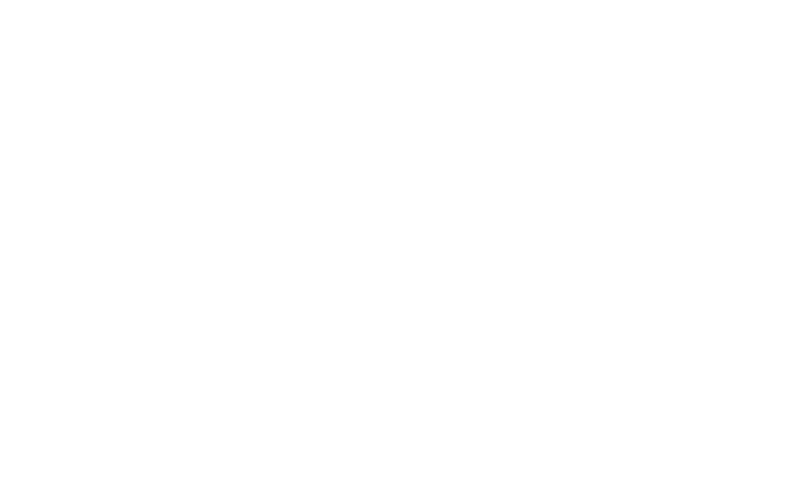

<!-- Header -->

  

<!-- Intro -->
<h2 align="center">Hello there, I'm Vishesh Verma 👋 </h2> 

Enthusiastic about crafting engaging user experiences through frontend development. 🚀 Open to collaborations and new opportunities 💼

<!-- Badges -->

  
  
  

  

<!-- About Me -->
## 🌟 About Me  

Hey there! I'm Vishesh Verma, a Third-year Computer Science student ith a strong passion for software development and problem-solving.

Beyond development, I'm deeply passionate about coding and problem-solving. I thrive on the challenges presented by algorithmic puzzles and coding competitions. With a CodeChef rating of 1607 (a 3-star coder) and a Codeforces highest rating of 1169, I'm constantly pushing my boundaries and expanding my skill set in the world of competitive programming.

<!-- Skills -->
## 🔧 Skills

- **Languages:** 

  
 
  
 
 
 
 
  
 

- **Tools & Technologies:** 

<a href="https://getbootstrap.com" target="_blank" rel="noreferrer"> 

- **Database/Framework/Libraries:**

<!-- Projects -->
## 💼 Featured Projects

### BlogSpot
- **Description:** Built a blog website using React, Appwrite, and Tailwind CSS.
- **Features:** User authentication, real-time post editing with TinyMCE, Redux Toolkit for state management.
- **Link:** [BlogSpot Project](https://blogspot-vishesh-vermas-projects-6b38deae.vercel.app/)
### YouTwit
- **Description:** Hybrid platform combining YouTube and Twitter functionalities using Node.js, Express.js, MongoDB, and JWT for authentication.
- **Features:** Secure media handling with Cloudinary and Multer middleware, robust password hashing with bcrypt.
- **Link:** [YouTwit Project](https://github.com/Vishesh-Verma-07/YouTwit)

### Melody Masters
- **Description:** Music education platform built with Next.js and TypeScript, focusing on performance optimization and UI design.
- **Features:** Utilized Acertinity UI and Tailwind CSS for responsive UI, SSR and SSG for performance enhancement.
- **Link:** [Melody Masters Project](https://melody-masters-git-main-vishesh-vermas-projects-6b38deae.vercel.app/)

<a href="https://github.com/Vishesh-Verma-07?tab=repositories" target="_blank" rel="noreferrer"> [View all projects] </a>

<!-- Education -->
## 🎓 Education

- **Bachelor of Technology in Computer Science Engineering[CGPA of 9.1]**: Medicaps University, August 2022 - June 2026.

<!-- Certifications -->
## 🏅 Certifications

- **<a href="https://drive.google.com/file/d/1h2n9uVmut6Waz63OITZTY8on7qCS_jg6/view" > [Certification] </a>**: Medicaps University, 2023.
<!-- Let's Connect -->
## 🤝 Let's Connect

- LinkedIn: <a href="https://www.linkedin.com/in/vishesh-verma-76645924a/" style="color: white;">Vishesh Verma</a>
- Email me at: visheshverma250703@gmail.com

Feel free to reach out! I'm always open to new opportunities, collaborations, and conversations.
